# 🚀 JVB Backend Project

## 🐳 Docker Setup

  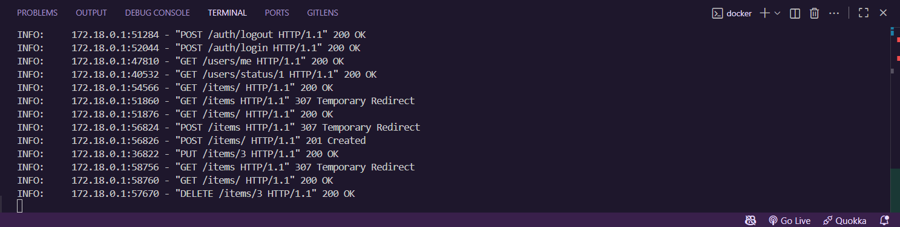

---

## 🔐 Auth Module

### 🔸 Đăng ký tài khoản

  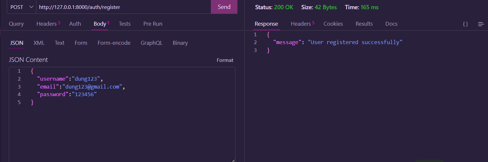

### 🔸 Đăng nhập

  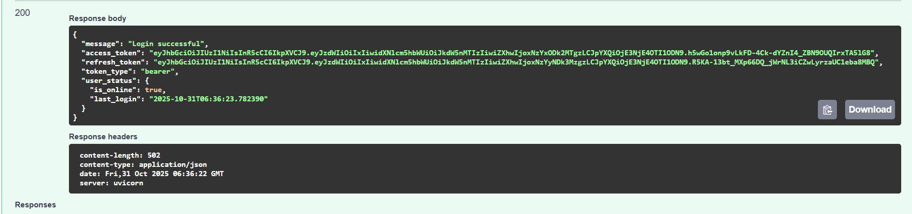

### 🔸 Đăng xuất

  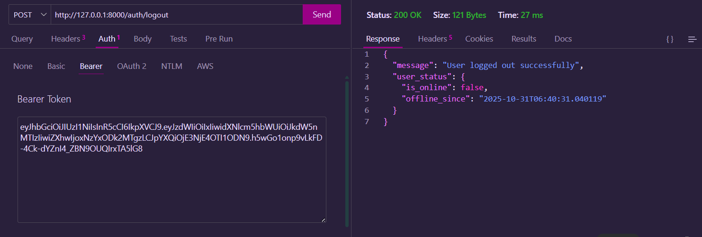

---

## 📦 Item Module

### 🆕 Tạo mới Item

  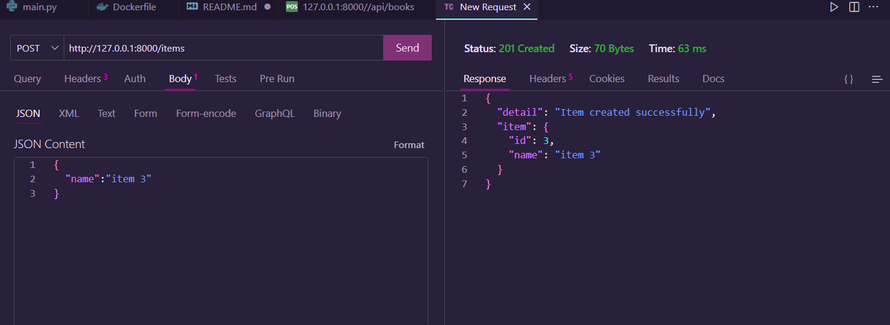

### 🧾 Danh sách Item

  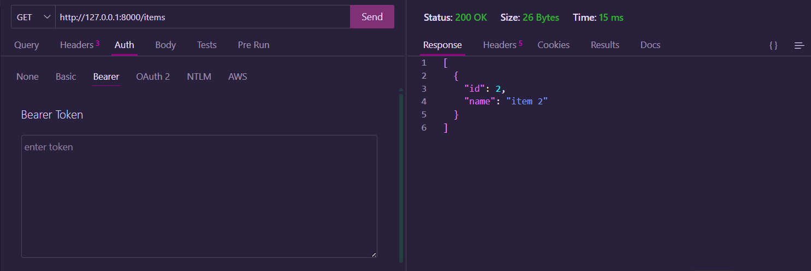

### ✏️ Cập nhật Item

  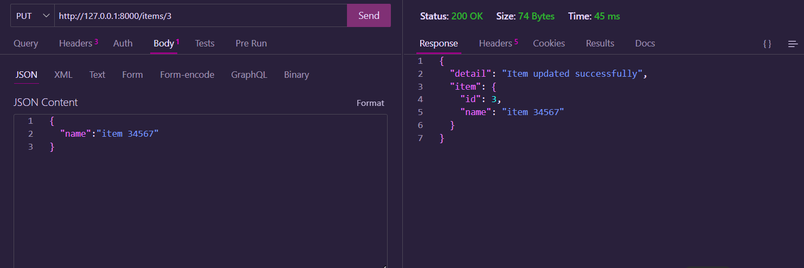

### ❌ Xóa Item

  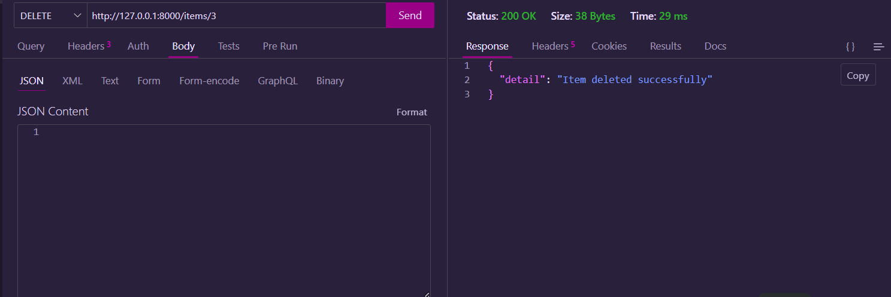

---

## 👤 User Module

### 🔸 Thông tin người dùng hiện tại

  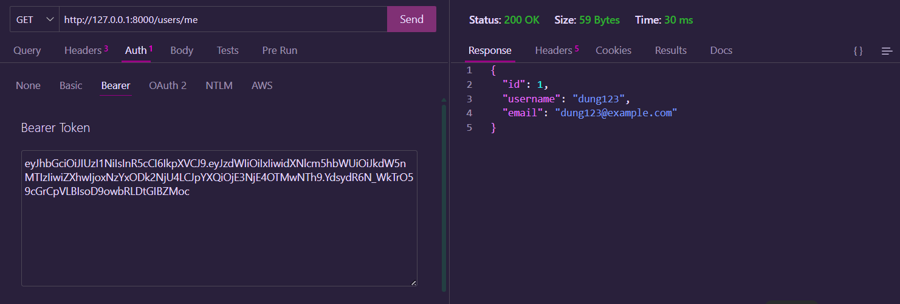

### 🔸 Danh sách tất cả người dùng

  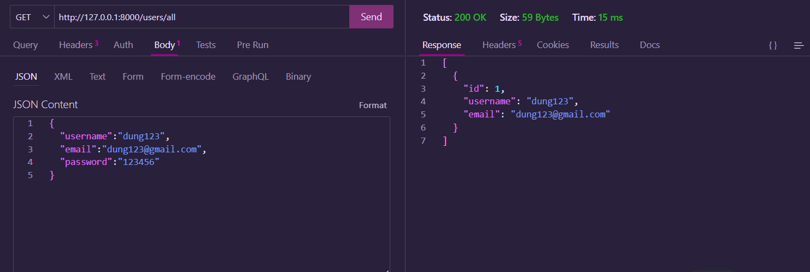

### 🔸 Trạng thái người dùng

  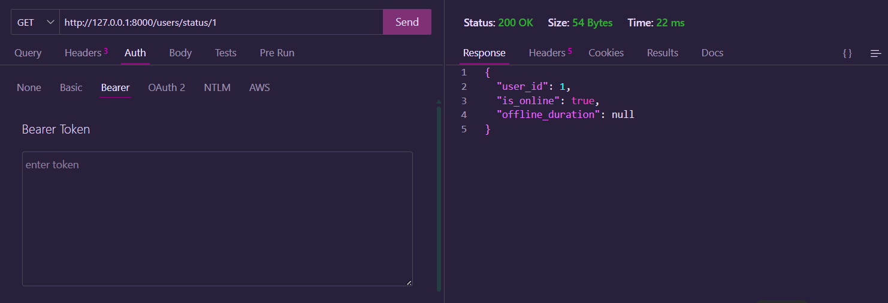

> 👨‍💻 **Tác giả:** Nguyễn Duy Dũng  
> 📅 Phiên bản: 1.0.0  
> 🧠 Framework: FastAPI